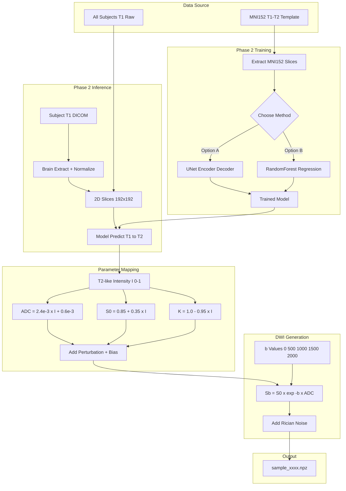

# Phase 2 模拟数据生成整体流程框架与原理

> 本文档聚焦于 `final/` 文件夹中**Phase 2**的数据生成管线 —— 从真实T1数据出发, 通过机器学习模型合成T2-like图像, 再经连续灰度映射得到ADC真值并前向生成DWI模拟数据。



---

## 1. 整体管线总览

整个项目的核心目标是: **用真实T1加权MRI数据"捏"出具有真实脑解剖结构的DWI模拟数据**。Phase 2相对于Phase 1 (简单灰度反转) 的核心改进是: **用MNI152模板上配准好的T1-T2对训练一个映射模型, 让模型学会更真实的T1→T2对比度转换**。

```
┌──────────────────────────────────────────────────────────────────────────┐
│                         数据源层                                           │
│  All_Subjects_T1_Raw/       MNI152 模板 (T1+T2 paired)                    │
│  (~50组真实人脑T1 DICOM)    (ICBM 2009a, 标准空间配准)                     │
└──────────────────────┬───────────────────────┬──────────────────────────┘
                       ↓                       ↓
┌──────────────────────────────────────────────┴──────────────────────────┐
│   Phase 2 训练阶段: 在MNI152上学习T1→T2映射                               │
│                                                                          │
│   方案A: UNet (PyTorch)                  方案B: RandomForest (sklearn)    │
│   ┌────────────────────────┐            ┌────────────────────────────┐   │
│   │ 端到端卷积神经网络      │            │ 逐像素特征工程 + 集成树回归  │   │
│   │ 编码器-解码器+跳跃连接   │            │ 10维特征: 强度/局部均值/   │   │
│   │ 损失: L1 + 0.5×SSIM   │            │ 标准差/梯度/空间坐标      │   │
│   │ 输入: 1×192×192 T1    │            │ 训练: ~200万像素点         │   │
│   │ 输出: 1×192×192 T2    │            │ 推理: 逐像素预测后重建成图 │   │
│   └───────────┬────────────┘            └───────────┬────────────────┘   │
└───────────────┼────────────────────────────────────┼─────────────────────┘
                ↓                                    ↓
┌──────────────────────────────────────────────────────────────────────────┐
│  Phase 2 推理阶段: 用训练好的模型预测T2-like                              │
│                                                                          │
│  输入: Subject T1 DICOM → 脑提取 → 归一化 → 提取2D切片                   │
│  中间: 模型预测 → T2-like图像 (归一化[0,1])                              │
└───────────────────────────────────┬──────────────────────────────────────┘
                                    ↓
┌──────────────────────────────────────────────────────────────────────────┐
│  参数映射层 (核心公式)                                                     │
│                                                                          │
│  T2-like灰度 I ∈ [0,1]                                                   │
│       ↓ 连续线性映射 (无需组织分割)                                       │
│  ADC = 2.4×10⁻³ × I + 0.6×10⁻³   (mm²/s)   ← 生理驱动力                 │
│  S0  = 0.85 + 0.35 × I                       ← 质子密度效应              │
│  K   = 1.0 - 0.95 × I                        ← 扩散峰度效应              │
│       ↓ + 组织内随机扰动 + 低频偏置场                                     │
│  每个像素有独立生理参数, 保留T2自带的解剖纹理                               │
└───────────────────────────────────┬──────────────────────────────────────┘
                                    ↓
┌──────────────────────────────────────────────────────────────────────────┐
│  DWI前向生成层                                                           │
│                                                                          │
│  信号模型: S(b)=S₀×exp(-b×ADC)    b=[0,500,1000,1500,2000]             │
│  噪声模型: S_noisy = √((S_clean+n₁)²+n₂²)   n₁,n₂~N(0,σ²)              │
│  输出: dwi_clean / dwi_noisy 各5张192×192 DWI                           │
└───────────────────────────────────┬──────────────────────────────────────┘
                                    ↓
┌──────────────────────────────────────────────────────────────────────────┐
│  存储层                                                                  │
│  sample_xxxx.npz:                                                        │
│  {dwi_clean, dwi_noisy, bvals, s0_gt, d_gt, k_gt, adc_gt,              │
│   mask, tissue_label, noise_sigma, slice_idx, subject, source}          │
└──────────────────────────────────────────────────────────────────────────┘
```

---

## 2. 数据来源

### 2.1 实验T1数据: `All_Subjects_T1_Raw/`

| 项目 | 说明 |
|------|------|
| 数据量 | ~50组人脑T1加权DICOM |
| 尺寸 | 多为 512×512×176~192 |
| 格式 | 原始DICOM序列 (多层堆叠为3D体积) |
| 来源 | MRI课程同学自采数据 |

### 2.2 训练模板数据: `MRI_analog_data/data/templates/`

使用**MNI152 ICBM 2009a Nonlinear Symmetric**标准脑模板:

| 文件 | 内容 | 尺寸 |
|------|------|------|
| `mni_icbm152_t1_tal_nlin_sym_09a.mnc` | T1加权模板 | 约 193×229×193 |
| `mni_icbm152_t2_tal_nlin_sym_09a.mnc` | T2加权模板 | 约 193×229×193 |

这两个模板经过严格配准, 同一空间坐标下T1和T2信号一一对应, 为监督学习提供天然的paired训练数据。

MNI152模板在不同脑区层面的T1与T2切片对例如下 (从上到下: 颅顶→中部→颅底):

[](data/MNI152_T1_T2_training_pairs.png)
*图: MNI152 T1 (上行) 与 T2 (下行) 配准切片对。每列为同一个空间位置, 可见T1和T2的对比度规律相反 (T1: WM亮CSF暗, T2: CSF亮WM暗), 且脑解剖结构完全对齐。*

[](data/MNI152_T1_T2_single_slice_detail.png)
*图: 中部层面单张切片的详细对比。左: T1/T2/Phase1反转/UNet合成对比; 右: 误差热图与散点图。可见UNet合成T2与真实T2的偏差明显小于Phase 1简单反转。*

---

## 3. 预处理流程 (数据加载与清洗)

### 3.1 DICOM加载

```python
def load_dicom_subject(subject_dir):
    """从DICOM文件夹加载3D T1体积"""
    # 自动定位DICOM文件夹
    # 按InstanceNumber排序堆叠切片
    # 返回: volume [H, W, N_slices]
```

### 3.2 脑提取 (Brain Mask)

```
volume > 0.1×max(volume)
    → 二值阈值化
    → binary_fill_holes (孔洞填充)
    → 最大连通域保留 (去除噪声小块)
    → brain_mask
```

### 3.3 归一化

仅在brain mask内做min-max归一化:

```python
norm = (volume - vmin) / (vmax - vmin + 1e-10)
norm[~mask] = 0.0
norm = clip(norm, 0, 1)
```

### 3.4 2D切片提取

采用三种策略自动选择有效切片:

| 策略 | 逻辑 | 适用场景 |
|------|------|---------|
| `uniform` | 在全脑范围内均匀采样N张 | **默认推荐**, 覆盖全脑 |
| `central` | 只取脑区面积最大的N张 | 只关注脑中部 |
| `sequential` | 顺序取前N张 | 调试用 |

自动过滤颅顶/颅底的低脑区切片: `面积 > 最大面积 × 20%`。

---

## 4. Phase 2 核心: T1→T2合成模型

### 4.1 方案A: UNet (PyTorch, 推荐)

#### 网络架构

采用标准2D UNet, 包含编码器(下采样路径)、瓶颈层、解码器(上采样路径)和跳跃连接四部分, 4层深度:

```mermaid
graph LR
    subgraph Encoder
        IN[Input<br/>1x192x192]
        C1[Conv3+BN+ReLU<br/>64]
        P1[MaxPool 2x2]
        C2[Conv3+BN+ReLU<br/>128]
        P2[MaxPool 2x2]
        C3[Conv3+BN+ReLU<br/>256]
        P3[MaxPool 2x2]
        C4[Conv3+BN+ReLU<br/>512]
        P4[MaxPool 2x2]
        IN --> C1 --> P1 --> C2 --> P2 --> C3 --> P3 --> C4 --> P4
    end

    subgraph Bottleneck
        B[Conv3+BN+ReLU<br/>1024]
        P4 --> B
    end

    subgraph Decoder
        U1[UpConv 2x2<br/>512] --> M1[Merge with Skip4]
        U2[UpConv 2x2<br/>256] --> M2[Merge with Skip3]
        U3[UpConv 2x2<br/>128] --> M3[Merge with Skip2]
        U4[UpConv 2x2<br/>64] --> M4[Merge with Skip1]
        M1 --> D1[Conv3+BN+ReLU<br/>512]
        M2 --> D2[Conv3+BN+ReLU<br/>256]
        M3 --> D3[Conv3+BN+ReLU<br/>128]
        M4 --> D4[Conv3+BN+ReLU<br/>64]
        D1 --> U2
        D2 --> U3
        D3 --> U4
        D4 --> OUT[Conv1x1<br/>1x192x192]
    end

    B --> U1

    C4 -.->|Skip4| M1
    C3 -.->|Skip3| M2
    C2 -.->|Skip2| M3
    C1 -.->|Skip1| M4
```



**编码器 (Encoder, 下采样路径)**: 每层由一个 `MaxPool2d(2×2)` (空间尺寸减半) 接一个 `DoubleConv` 组成。

```
DoubleConv:
  Conv2d(in_ch, out_ch, kernel=3, padding=1) → BatchNorm2d → ReLU
  → Conv2d(out_ch, out_ch, kernel=3, padding=1) → BatchNorm2d → ReLU
```

**瓶颈层 (Bottleneck)**: 最低分辨率 (12×12) 处的最大感受野特征, 用 DoubleConv 提取全局上下文信息。

**解码器 (Decoder, 上采样路径)**: 每层由 `ConvTranspose2d` (2倍上采样) 接**跳跃连接拼接**再接 `DoubleConv`。

```
Up:
  ConvTranspose2d(in_ch, in_ch//2, kernel=2, stride=2) → 上采样
  → 拼接(Crop对齐后的编码器同层特征)
  → DoubleConv(in_ch, out_ch)
```

**跳跃连接 (Skip Connections)**: 将编码器每层的特征图直接拼接到解码器对应层, 使网络同时利用**浅层的精细空间信息** (边缘、位置) 和**深层的语义信息** (组织类别、全局结构)。这是UNet相对于普通编解码器网络的核心改进。

**输出层**: `Conv2d(64, 1, kernel=1)` 将64通道特征压缩为单通道T2预测图。

**参数量估计**:

| 层级 | 输入通道→输出通道 | 参数量 (约) |
|------|-----------------|------------|
| input → inc | 1→64 | 37K |
| down1 | 64→128 | 295K |
| down2 | 128→256 | 1.18M |
| down3 | 256→512 | 4.72M |
| down4 | 512→1024 | 18.9M |
| up1 | 1024→512 | 14.2M |
| up2 | 512→256 | 3.54M |
| up3 | 256→128 | 885K |
| up4 | 128→64 | 221K |
| output | 64→1 | 65 |
| **总计** | | **~44.7M** |

**为什么UNet适合T1→T2映射**:
1. **对称编解码结构**: 编码器逐步提取T1中的多尺度特征 (从边缘到脑区结构), 解码器将这些特征重建成T2图像
2. **跳跃连接保留细节**: T1→T2映射需要保留精细的解剖边界 (脑沟回、脑室边界), 跳跃连接确保浅层空间信息不丢失
3. **医学图像领域的先验适配**: UNet在医学图像分割和跨模态合成任务中被广泛验证有效

#### 损失函数

```
L_total = L₁(y_pred, y_gt) + 0.5 × L_SSIM(y_gt, y_pred)
```

SSIM (结构相似性) 的计算公式:

```
SSIM(x,y) = (2μ_xμ_y + C₁)(2σ_xy + C₂) / ((μ_x² + μ_y² + C₁)(σ_x² + σ_y² + C₂))
C₁ = (0.01)², C₂ = (0.03)²
```

#### 训练参数

| 参数 | 取值 |
|------|------|
| 训练/验证切片数 | ~152 / ~17 (10:1分割, 从MNI152轴向提取) |
| Epochs | 50-80 |
| Batch size | 4-8 |
| 优化器 | Adam, lr=1×10⁻⁴ |
| LR调度 | ReduceLROnPlateau(patience=5, factor=0.5) |
| 输入/输出尺寸 | 1×192×192 (T1) → 1×192×192 (T2) |

#### 训练结果

[](models/loss_curves.png)
*图: UNet训练损失曲线。蓝线为训练损失, 红线为验证损失。绿虚线标记最佳验证损失(约30-40epoch收敛)。损失函数为 L₁ + 0.5×(1-SSIM)。*

[](models/validation_results.png)
*图: UNet在MNI152验证集上的T1→T2合成效果。每列: T1输入 → 合成T2 → 真实T2 → 误差图 → PSNR/SSIM指标。可观察到合成T2的WM/GM对比度与真实T2高度一致。*

[](models/metrics_distribution.png)
*图: 验证集各切片的PSNR和SSIM分布直方图。平均PSNR ~31dB, 平均SSIM ~0.90, 表明合成质量较高。*

#### 训练过程可视化

训练过程中每10个epoch自动保存各阶段的预测效果对比:

| Epoch 1 | Epoch 50 | Epoch 80 |
|---------|----------|----------|
| [](training_vis/epoch_001.png) | [](training_vis/epoch_050.png) | [](training_vis/epoch_080.png) |

*图: 训练过程中不同epoch的T1→T2预测效果。从初始的模糊/不准确逐步收敛到精细结构。*

### 4.2 方案B: RandomForest (sklearn, 轻量替代)

作为无需GPU的替代方案, 使用RandomForest回归器逐像素学习T1→T2映射。

#### 特征工程

为brain mask内每个像素提取10维特征:

| # | 特征 | 描述 | 感受野 |
|---|------|------|--------|
| 1 | `I_T1` | 中心像素值 | 1×1 |
| 2 | `μ₃` | 3×3局部均值 | 3×3 |
| 3 | `μ₅` | 5×5局部均值 | 5×5 |
| 4 | `μ₇` | 7×7局部均值 | 7×7 |
| 5 | `σ₃` | 3×3局部标准差 | 3×3 |
| 6 | `σ₅` | 5×5局部标准差 | 5×5 |
| 7 | `σ₇` | 7×7局部标准差 | 7×7 |
| 8 | `|∇G|` | 高斯梯度幅值 (σ=1) | — |
| 9 | x_norm | 归一化x坐标 | 全局 |
| 10 | y_norm | 归一化y坐标 | 全局 |

#### 训练配置

```python
model = RandomForestRegressor(
    n_estimators=100,
    max_depth=25,
    min_samples_leaf=5,
    n_jobs=-1,
    random_state=42
)
```

| 参数 | 取值 |
|------|------|
| 训练样本 | ~200万像素 (每层最多3000, 随机采样) |
| 训练时间 | ~1-2分钟 (CPU) |
| 模型大小 | ~30 MB |

#### RF合成效果

[](models/rf_model_test.png)
*图: RandomForest在MNI152测试切片上的效果: T1输入(左) → RF合成T2(中) → 真实T2(右); 误差图(左下)和散点图(中下)。MAE ~0.05, R² ~0.90。*

### 4.3 两种方案对比

| 维度 | UNet | RandomForest |
|------|------|-------------|
| 框架 | PyTorch | sklearn |
| GPU需求 | 可选(CUDA加速) | 不需要 |
| 训练时间 | ~15-30分(GPU) | ~1-2分(CPU) |
| 推理方式 | 端到端卷积 | 逐像素预测+重建 |
| 空间连续性 | ✅ 天然保持 | ⚠️ 需特征工程补偿 |
| 合成质量 | PSNR~31dB, SSIM~0.90 | MAE~0.05, R²~0.90 |
| 模型大小 | ~120MB (.pth) | ~30MB (.pkl) |

---

## 5. 核心物理映射: T2灰度→ADC (连续灰度映射法)

这是整个模拟数据生成的**生理物理核心**: 利用T2加权信号与ADC(表观扩散系数)之间的天然正相关关系, 用连续线性映射直接得到ADC真值图, **完全不需要组织分割**。

### 5.1 生理基础

| 组织 | T2信号强度 | T2物理机制 | ADC值 | 扩散机制 |
|------|-----------|-----------|-------|---------|
| CSF (脑脊液) | **高** (亮) | 含水量高, T2衰减慢 | **2.5~3.0×10⁻³** | 水分子近乎自由扩散 |
| GM (灰质) | 中 | 细胞结构中等 | **0.9~1.2×10⁻³** | 细胞内+细胞外受限扩散 |
| WM (白质) | **低** (暗) | 髓鞘脂质, T2衰减快 | **0.6~0.7×10⁻³** | 髓鞘强限制扩散 |

**关键洞察**: T2亮度与ADC呈**正相关**, 因此可以用一个简单的线性函数 `ADC = f(I_T2)` 直接映射, 无需显式分割组织类型。T2图像中的自然纹理 (如WM/GM边界、脑沟回结构) 被完整保留到ADC图中。

### 5.2 ADC映射公式

```
ADC(x,y) = α · I_T2(x,y) + β

其中:
  α = 2.4 × 10⁻³  (mm²/s)
  β = 0.6 × 10⁻³  (mm²/s)
  I_T2 ∈ [0, 1]   (归一化T2灰度)

边界检验:
  I_T2 = 0 (WM):     ADC = 0.6 × 10⁻³  ✓
  I_T2 = 0.25 (GM):  ADC = 1.2 × 10⁻³  ✓
  I_T2 = 1.0 (CSF):  ADC = 3.0 × 10⁻³  ✓
```

### 5.3 S0映射

```
S0(x,y) = S0_WM + (S0_CSF - S0_WM) × I_T2(x,y)
         = 0.85 + 0.35 × I_T2(x,y)
```

S0 (b=0的信号强度) 也和组织类型相关: CSF的质子密度高 → S0高; WM的质子密度相对低 → S0低。

### 5.4 K映射

```
K(x,y) = K_WM - (K_WM - K_CSF) × I_T2(x,y)
        = 1.0 - 0.95 × I_T2(x,y)
```

K (扩散峰度) 与T2亮度**成反比**: WM中扩散高度非高斯 (K≈1.0), CSF中近乎高斯 (K≈0.05)。

### 5.5 灰度映射的数值映射关系

```
T2灰度 I     ADC (×10⁻³)    S0          K
  0.0  →      0.60        0.850       1.000
  0.2  →      1.08        0.920       0.810
  0.4  →      1.56        0.990       0.620
  0.6  →      2.04        1.060       0.430
  0.8  →      2.52        1.130       0.240
  1.0  →      3.00        1.200       0.050
```

---

## 6. 数据增强: 模拟真实MRI的退化

为使模拟数据更贴近临床真实扫描, 在参数图中加入两种MRI物理退化。

### 6.1 组织内随机扰动

每个像素的参数值在基底值上乘以随机因子:

| 参数 | 标准差 | 说明 |
|------|--------|------|
| S0 | σ=0.05 (5%) | 模拟质子密度的微观波动 |
| ADC | σ=0.03 (3%) | 模拟扩散系数的组织内异质性 |
| K | σ=0.10 (10%) | 峰度对微结构更敏感, 波动更大 |

```python
def add_internal_variation(param_map, mask, noise_std):
    noise = np.random.normal(1.0, noise_std, size=param_map.shape)
    param_map[mask] *= noise[mask]
    return param_map
```

### 6.2 低频偏置场 (Bias Field)

模拟MRI线圈灵敏度不均匀导致的信号强度空间渐变:

```python
bias(x,y) = 1 + 0.10·(x/W·2-1) + 0.08·(y/H·2-1) + 0.05·(x/W·2-1)·(y/H·2-1)
```

仅在S0上施加偏置场, 不影响ADC/K等生理参数。

---

## 7. DWI前向生成

### 7.1 信号模型: ADC单指数

本项目采用**简化ADC单指数模型**:

```
S(b) = S₀ × exp(-b × D)
```

> **说明**: K参数图虽然保留在npz中供后续DKI (扩散峰度成像) 使用, 但此处DWI生成仅用ADC单指数模型 (不含 (1/6)b²D²K 项), 由命令行参数 `--use_kurtosis` 控制开启。

### 7.2 多b值配置

```python
bvals = np.array([0, 500, 1000, 1500, 2000], dtype=np.int32)
```

### 7.3 Rician噪声模型

真实MRI的幅值重建导致噪声服从**Rician分布**, 而非高斯分布:

```python
def add_rician_noise(dwi_clean, sigma=0.03):
    n1 = np.random.normal(0, sigma, size=dwi_clean.shape)  # 实部噪声
    n2 = np.random.normal(0, sigma, size=dwi_clean.shape)  # 虚部噪声
    return np.sqrt((dwi_clean + n1)**2 + n2**2)             # 幅值重建
```

**Rician噪声的特征**: 在低SNR区域 (b值大, 信号弱), 噪声基底抬高, 信号不再呈零均值 — 这在真实MRI中非常典型。

#### 多b值DWI可视化

[](data/01_MNI152_Grayscale/sample_0000_bvals.png)
*图: MNI152 T2灰度映射法生成的DWI多b值可视化。上行Clean (无噪声), 下行Noisy (σ=0.03)。从左到右: b=0, 500, 1000, 1500, 2000。可见随b值升高信号逐渐衰减, 且Rician噪声在低信号区域更加明显。*

---

## 8. 组织标签生成

虽然没有使用组织分割来赋值参数, 但从T2灰度阈值可以生成近似的组织标签, 用于ROI分析评价:

```python
label[mask & (t2_norm > 0.70)] = 1   # CSF
label[mask & (t2_norm > 0.35 & ≤0.70)] = 2  # GM
label[mask & (t2_norm ≤ 0.35)] = 3   # WM
label[~mask] = 0                       # Background
```

---

## 9. 完整数据输出格式

每个样本保存为 `.npz` 文件, 包含14个字段:

| 字段 | dtype | shape | 说明 |
|------|-------|-------|------|
| `dwi_clean` | float32 | (5, H, W) | ADC单指数前向无噪声DWI |
| `dwi_noisy` | float32 | (5, H, W) | 添加Rician噪声后的DWI |
| `bvals` | int32 | (5,) | b值序列 [0,500,1000,1500,2000] |
| `s0_gt` | float32 | (H, W) | S0基图 (含偏置场/扰动) |
| `d_gt` | float32 | (H, W) | 扩散系数D (含扰动) |
| `k_gt` | float32 | (H, W) | 峰度系数K (含扰动) |
| `adc_gt` | float32 | (H, W) | ADC真值 (无扰动, 供评价对比) |
| `mask` | bool | (H, W) | 脑区mask |
| `tissue_label` | int32 | (H, W) | 组织标签 0=BG,1=CSF,2=GM,3=WM |
| `noise_sigma` | float32 | scalar | Rician噪声标准差 |
| `slice_idx` | int32 | scalar | 原始体积切片索引 |
| `subject` | str | — | 被试名称 |
| `source` | str | — | 生成管线标识 |
| `description` | str | — | 字段说明文本 |

注: H=W=192 (默认配置)。

---

## 10. 单subject完整预览 (Phase 1 vs Phase 2)

以下为同一subject分别用Phase 1和Phase 2生成的完整结果对比:

### Phase 1 Subject Preview

[](data/02_Phase1_T1_Inversion/mricourse_child1_20240803_preview.png)
*图: Phase 1 (T1反转法) — 某subject的6个切片预览。每行: T1输入 / T2-like / ADC(×10⁻³) / S0 / K / DWI(b=1000)。*

### Phase 2 UNet Subject Preview

[](data/03_Phase2_UNet_fig/mricourse_child1_20240803_preview.png)
*图: Phase 2 (UNet合成法) — 同一subject的对应切片。注意T2-like的WM/GM对比度比Phase 1反转法更接近真实T2的灰度层次。*

### All Subjects 总览

[](data/02_Phase1_T1_Inversion/all_subjects_summary.png)
*图: Phase 1所有subject总览。每列为一个人脑的三个参数图: T2-like / ADC(×10⁻³) / DWI(b=500)。可见不同人脑的解剖结构多样性。*

[](data/03_Phase2_UNet_fig/all_subjects_summary.png)
*图: Phase 2 UNet所有subject总览。与Phase 1相比, T2-like的对比度更丰富, WM/GM边界更清晰。*

---

## 11. 代码文件组织

| 文件 | 角色 | 关键函数 |
|------|------|---------|
| `t1_comprehensive_pipeline.py` | **主管线** 整合Phase1+Phase2 | `phase1_process_all()`, `phase2_train()`, `phase2_inference_all()` |
| `train_unet_model.py` | UNet训练 (独立脚本, 含完整可视化) | `train()`, `load_and_prepare_data()` |
| `phase2_sklearn_train.py` | RandomForest训练 (独立脚本) | `train()`, `extract_patch_features()` |
| `t2_grayscale_mapping_pipeline.py` | MNI152 T2直接灰度映射 | `generate_sample()`, `t2_to_adc()` |
| `t2_deform_pipeline.py` | 弹性形变生成多形态脑 | `random_displacement_field()`, `generate_brain()` |
| `t2_variation_pipeline_v2.py` | 多维物理变异生成 | `random_contrast_mod()`, `random_bias_field()` |

### 主管线关键函数调用关系

```
main()
├── phase1_process_all()              # --phase 1
│   └── phase1_process_subject()      # 逐个subject处理
│       ├── load_dicom_subject()      # 加载DICOM
│       ├── auto_brain_mask()         # 脑提取
│       ├── normalize_volume()        # 归一化
│       ├── extract_slices()          # 切片提取
│       ├── t1_inversion_to_t2_like() # I_T2 = 1 - I_T1
│       └── generate_full_sample()    # ADC映射 + DWI生成
│
├── phase2_train()                    # --phase 2 --train
│   ├── load_mni152_templates()       # 加载MNI152 T1+T2
│   ├── prepare_mni152_pairs()        # 提取切片对
│   ├── train_unet()                  # 训练UNet
│   └── visualize_prediction()        # 验证可视化
│
└── phase2_inference_all()            # --phase 2 --inference
    └── phase2_inference_subject()    # UNet推理
        ├── load_dicom_subject()
        ├── auto_brain_mask()
        ├── normalize_volume()
        ├── extract_slices()
        ├── UNet forward pass         # 模型预测T2
        └── generate_full_sample()
```

---

## 12. 与Phase 1的对比总结

| 维度 | Phase 1: T1反转法 | Phase 2: UNet/RF合成 |
|------|------------------|---------------------|
| 方法 | `I_T2 = 1 - I_T1` (简单反转) | 从MNI152学习T1→T2非线性映射 |
| 训练成本 | 零, 即插即用 | 需预训练 (UNet~30min, RF~2min) |
| T2对比度 | 反转对比, 偏"假" | 接近真实T2, 层次更丰富 |
| WM/GM区分度 | 一般 | 明显改善 |
| 模型依赖 | 无 | PyTorch (UNet) / sklearn (RF) |
| 生成速度 | 快 (全CPU) | UNet需GPU加速, RF CPU可用 |

---

## 13. 核心公式速查

### 灰度映射 (T2 → 参数图)

```
ADC = 2.4×10⁻³ × I_T2 + 0.6×10⁻³   (mm²/s)
S0  = 0.85 + 0.35 × I_T2
K   = 1.0 - 0.95 × I_T2
```

### DWI前向 (ADC单指数)

```
S(b) = S₀ × exp(-b × D)    (不含K项)
```

### Rician噪声

```
S_noisy = √((S_clean + n₁)² + n₂²),   n₁,n₂ ~ N(0, σ²)
```

### 组织参数范围

| 组织 | ADC (×10⁻³ mm²/s) | S0 | K |
|------|-------------------|---|----|
| WM | 0.6 ~ 0.7 | 0.85 | 1.0 |
| GM | 0.9 ~ 1.2 | 0.94 | 0.76 |
| CSF | 2.5 ~ 3.0 | 1.20 | 0.05 |

---

## 14. 已生成数据规模

| 数据集 | 样本数 | 来源 | 生成方式 | 路径 |
|--------|-------|------|---------|------|
| MNI152灰度映射 | 30个2D样本 | MNI152 T2模板 | `t2_grayscale_mapping_pipeline.py` | `data/01_MNI152_Grayscale/` |
| Phase 1反转法 | ~860个2D样本 | ~50 subjects × 20 slices | `t1_comprehensive_pipeline.py --phase 1` | `data/02_Phase1_T1_Inversion/` |
| Phase 2 UNet | ~860个2D样本 | ~50 subjects × 20 slices | `t1_comprehensive_pipeline.py --phase 2` | `data/03_Phase2_UNet_Synthesis/` |
| 弹性形变 | 10个3D全脑 | MNI152变形 | `t2_deform_pipeline.py` | `output_deformed/` |
| 多维变异 | 10个3D全脑 | MNI152变异 | `t2_variation_pipeline_v2.py` | `output_v2/` |

---

## 15. 一句话总结

> **Phase 2的核心创新**: 用MNI152模板上的真实T1-T2配准对训练UNet/RF模型, 学会从T1到T2的真实对比度映射; 再通过T2灰度与ADC的**天然正相关性**(CSF最亮→ADC最高, WM最暗→ADC最低), 用连续线性映射 `ADC = 2.4×10⁻³×I_T2 + 0.6×10⁻³` 直接得到每个像素的生理参数, **无需组织分割**就能生成具有真实解剖纹理的ADC真值图, 最后用ADC单指数模型前向生成多b值DWI模拟数据。
